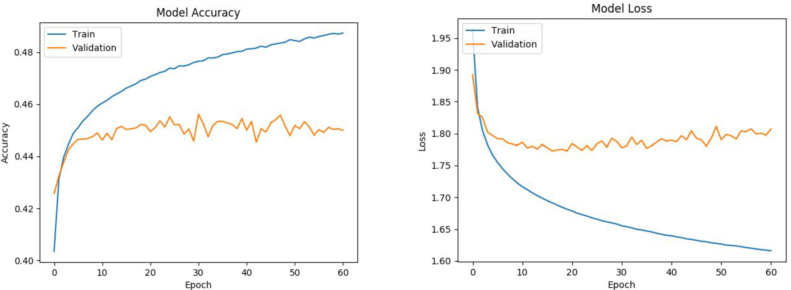

# Parking Ticket Analysis using Machine Learning
This work was done for Santa Clara University's Data Mining course taught by Professor Anastasiu

## Introduction

Three different machine learning models were built in order to predict the type of traffic violation written in any given scenario. We used an open source dataset made available on Kaggle by the NYC Department of Finance. We found our Deep Feedforward Neural Network to have the best performance with 45.4% accuracy. Although this is low, it proves that there is a correlation between the cleaned features that we generated and the violation code itself. This information can then be used to create a revenue optimization strategy so that law enforcement agencies can appropriately dedicate resources.

## Problem Statement

In fiscal year 2016, New York City generated $993 million in fines, a 35 percent increase in the last decade and 16 percent rise over the last four years. By far the largest category of fines continues to be parking violations, accounting for over 50% of the total revenue year after year. This exorbitant amount of state income is accomplished by means of over 10 million parking tickets issued yearly. As one can imagine, the state of New York heavily relies on this annual income and therefore dedicates many law enforcement resources to maintain it. This project seeks to understand how well parking tickets can be predicted based off of the available statistics of each violation. A prediction algorithm of such nature enables law enforcement agencies to create a revenue optimization strategy such that the same revenue numbers can be achieved while simultaneously allowing for the transfer of resources to more serious crimes.

<p align="center">
  
</p>

## Dataset

### [NYC Parking Tickets](https://www.kaggle.com/datasets/new-york-city/nyc-parking-tickets)

The NYC Department of Finance collects data on every parking ticket issued in NYC (~10M per year). This data is made publicly available to aid in ticket resolution and to guide policymakers. This dataset (found on Kaggle) consists of four files, covering Aug 2013-June 2017. The files are roughly organized by fiscal year (July 1 - June 30) with the exception of the initial dataset. The initial dataset also lacks 8 columns that are included in the other three datasets but these columns are used sparingly. Each column contains information about the violation such as the vehicle ticketed, the type of ticket issued, location, and time. In total the dataset is almost 9GB in size. This was too large for the hardware resources that we had access to so we distilled that data down by choosing 500k samples from each of the 4 fiscal years.

<p align="center">

| Data                  | Number of Samples | Number of Features | Number of non-zero values |
| :-------------------: | :---------------: | :----------------: | :-----------------------: |
| Raw Data (8.97GB)     | 42.3 million      | 51                 | N/A                       |
| Before Preprocessing  | 2 million         | 51                 | N/A                       |
| After Preprocessing   | 1.4 million       | 12                 | 18.2 million              |

</p>

### Preprocessing Efforts

Violation Code Distribution

Since our objective was to predict the type of violation, we first analyzed the violation code distribution. Of the 99 codes that exist, we found that 50% of the samples can be explained by just 6 codes. We therefore applied a threshold to the data, removing any violdation code that contained less than 100 samples. In doing this, we were able to keep 99.9% of the initial two million samples and reduced the number of violation codes from 99 to 63. The bar plot below demonstrates the lopsided nature of this distribution 

<p align="center">
  
</p>

Feature Selection

Of the 51 features available, many contained little to no data. These sparse features ranged from having less than 20% non-null values all the way down to less than 1%. There were also features that exhibited little to no correlation with the violation code or were disregarded due to their similarity with other features. To this extent we narrowed the features down to the 12 below

<p align="center">

| Selected Features   |                 |                     |                     |
| :------------------ | :-------------- | :------------------ | :------------------ |
| Registration State  | Plate Type      | Issue Date          | Vehicle Body Type   |
| Vehicle Make        | Issuing Agency  | Violation Precinct  | Violation Time      |
| Issuer Precinct     | Vehicle Color   | Street Name         | Violation County    |

</p>

Feature Cleaning

Many of the features in the list above required cleaning due to samples having unusable representations or sub-categories not matching the parent feature. Below contains a detailed description of how this was addressed.

* Registration State: Contained a ‘99’ category that didn’t match the parent feature. All samples that had this value were dropped.
* Plate Type: Contained a ‘999’ category that didn’t match the parent feature. All samples that had this were dropped
* Issue Date: This feature was recorded as Year/Month/Day. Each date was converted to the corresponding day of the week (Monday-Sunday) which was believed to be a better representation of the data.
* Vehicle Color: There was quite a bit of inconsistency in the way vehicle colors were transcribed. For example, the color silver was recorded as ‘sl’, ‘silvr’, ‘sil’, ‘silve’, and ‘silver’, and as a result we decided to combine all these together into a unified color labeled ‘silver’. There were also colors such as ‘dark blue’ and ‘dark green’ which were binned into ‘blue’ and ‘green’ respectively.
* Violation Time: This feature was recorded as hh:mm (AM/PM). To make a better use of this feature we divided the day into 3 periods: morning, afternoon, evening. The time was first converted to a 24 hour clock and then binned appropriately with morning occurring from 5-11, afternoon from 11-17, and evening from 17-5.

Feature Thresholding

Similar to the violation code, we applied a threshold to each feature to ensure that there was enough of each subcategory to be able to make a meaningful prediction. Not all the features have the same threshold because it is a function of the sub-category distribution in each feature.

<p align="center">

| Feature Thresholding     |                      |                          |                           |
| :----------------------- | :------------------- | :----------------------- | :------------------------ |
| Registration State: 100  | Plate Type:     100  | Issue Date:         100  | Vehicle Body Type: 5000   |
| Vehicle Make:       220  | Issuing Agency: 1000 | Violation Precinct: 100  | Violation Time:    20     |
| Issuer Precinct:    100  | Vehicle Color:  100  | Street Name:        100  | Violation County:  2000   |

</p>

## Models

### [Deep Feedforward Neural Network](https://keras.io/api/)

A deep feedforward neural network with 5 hidden fully-connected layers was built. Each layer contains 128 neurons. The activation function of all the layers is LeakyReLU, except the last layer, which uses a softmax function. To preserve the best checkpoint during training, the EarlyStopping functionality is used to monitor validation categorical accuracy at every epoch. The parameters of EarlyStopping are configured to maximize validation categorical accuracy with a patience value of 30, meaning the network will continue training for 30 consecutive epochs more if overfitting is detected (i.e. the validation categorical accuracy does not increase). The Checkpoint functionality saves the best weights after every epoch. The network uses the Adam optimizer and a Categorical Cross-entropy loss function. The batch size is 32 and was trained for 100 epochs. The model was built using Keras.

<p align="center">
  
</p>

### [K-Nearest Neighbor (KNN)](https://scikit-learn.org/stable/modules/generated/sklearn.neighbors.KNeighborsClassifier.html)

The data structure used to feed into the KNN model was a numpy array but it was found that since the data is inherently very sparse due to the features being one-hot encoded, a more efficient data structure was a sparse matrix. Below demonstrates the runtime speed up achieved from this change. The execution times were estimated by clocking how long it took to classify 100 samples and then linearly scaled to project overall runtime. 

<p align="center">
  
</p>

In order to sweep through the KNN hyperparameters in a reasonable amount of time, the data was scaled back to 250k samples in order to observe which combination of parameters yielded the best performance. It is believed the same parameters are optimal for the larger dataset since the smaller subset contained 99% of the post one hot encoding features. The final hyperparameters found were a k of 50, Euclidean distance as the similarity metric, and uniform weights such that all points in each neighborhood are weighted equally.  

### [Decision Tree Classifier](https://scikit-learn.org/stable/modules/generated/sklearn.tree.DecisionTreeClassifier.html#sklearn.tree.DecisionTreeClassifier)

Many of the decision tree hyperparameters were left to their default values but the ones that were tuned are listed below

* *min_samples_split*: The minimum number of samples required to split an internal node. Value chosen was 2
* *min_samples_leaf*: The minimum number of samples required to be at a leaf node. A split point at any depth will only be considered if it leaves at least this number of training samples in each of the left and right branches. Value chosen was 1
* *max_features*: The number of features to consider when looking for the best split. The value chosen was "None" which indicates that the max number of features is the number of features in the input data 
* *class_weight*: The weights associated with classes. The "balanced" mode was used so that the of the weights are inversely proportional to class frequencies.

| Feature Thresholding     |                      |                          |                           |
| :----------------------- | :------------------- | :----------------------- | :------------------------ |
| Registration State: 100  | Plate Type:     100  | Issue Date:         100  | Vehicle Body Type: 5000   |
| Vehicle Make:       220  | Issuing Agency: 1000 | Violation Precinct: 100  | Violation Time:    20     |
| Issuer Precinct:    100  | Vehicle Color:  100  | Street Name:        100  | Violation County:  2000   |


## Training

We used a train test split of 80/20 to break up the data. The loss plots for the neural network are below 

<p align="center">
  
</p>

Note that the run time calculated is the measured time it takes to train and predict, ignoring all other computations. The models were run on a standard laptop with an Intel i7 and 32GB of RAM.

| Model                             | Train and Test Runtime |
| :-------------------------------: | :--------------------: |
| Deep Feedforward Neural Network   | 90 min                 |
| K-Nearest Neighbor (KNN)          | 226 min                |
| Decision Tree Classifier          | 7.75 min               |


## Results

| Model                             | Accuracy |
| :-------------------------------: | :------: |
| Deep Feedforward Neural Network   | 45.40%   |
| K-Nearest Neighbor (KNN)          | 38.80%   |
| Decision Tree Classifier          | 33.98%   |

We found the decision tree to have the fastest training time and the neural network to have the highest accuracy. If this were to be used in industry to optimize law enforcement strategies, we believe the neural network to be the best choice because online training could be employed as new training samples are published and the network's weights can be saved and loaded for instantaneous classification. We suspect that using a larger portion of the dataset would further the model accuracy.

## Usage

File Description (main files only)
* decision_tree.py - Decision Tree Classifier model
* knn.py - KNN model
* knn_sweep.py - Used to find optimal hyper parameters for KNN model
* nn_main.py - Neural network model
* preprocessing_1.py - Applies thresholds to features
* preprocessing_2.py - Performs feature cleaning 
* clean_data.csv - Output of preprocessing_1.py
* clean_data2.csv - Output of preprocessing_2.py

***

The raw dataset of 2 million samples was not included in this repository due to size limitations. However, the preprocessed data *clean_data2.csv* that the models use to train and validate on is included [here](./data/clean_data2.csv)

To re-train and verify the accuracy of each model, run each respective python script. Note that the data needs to be moved to the src directory or the file location needs to be edited in the model script. Each model can be run like this
```sh
    python nn_main.py
```